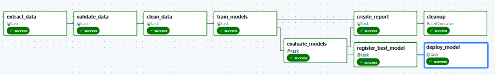
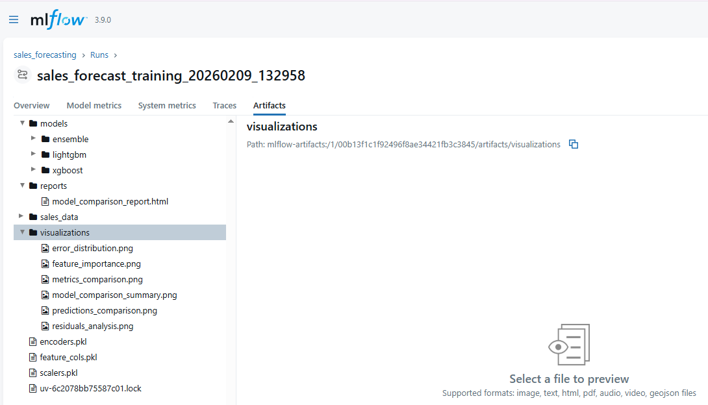
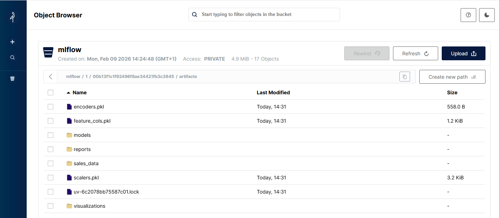
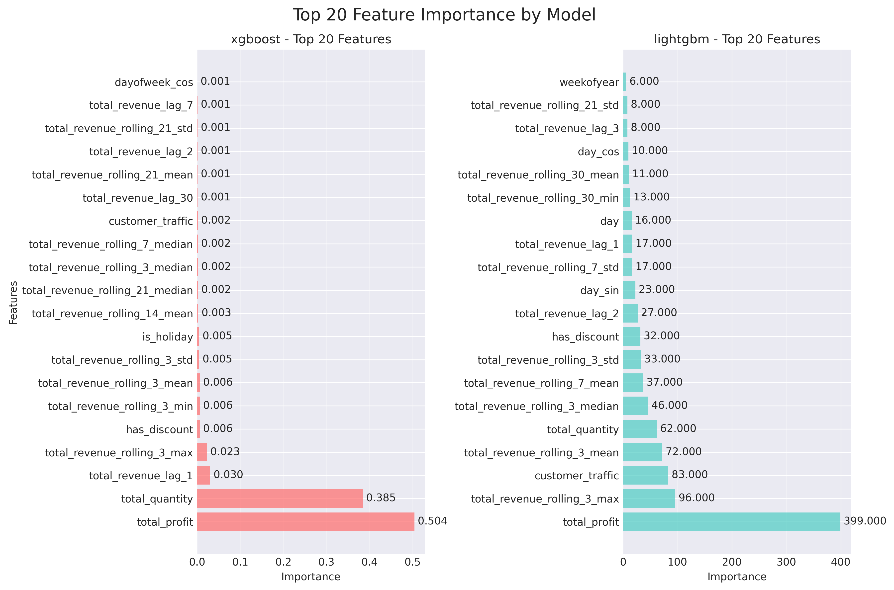

# Sales Forecasting ML Pipeline

This project implements an end-to-end machine learning pipeline for sales prediction. It combines ETL workflows orchestrated by Apache Airflow with advanced ML models (XGBoost and LightGBM) to deliver accurate revenue forecasts. The pipeline includes automated training, evaluation, visualization of results, and forecast predictions. Model artifacts and experiment results are tracked in MLflow and synchronized to MinIO S3 storage for persistence.

## Prerequisites

- **Docker Desktop** 
- **Astronomer CLI**: Install from [https://docs.astronomer.io/astro/cli/install-cli](https://docs.astronomer.io/astro/cli/install-cli)

## Quick Start

1. **Start the ML pipeline:**
   ```bash
   astro dev start
   ```

2. **Access the services:**
   - **Airflow UI**: http://localhost:8080 (username: `admin`, password: `admin`)
   - **MLflow UI**: http://localhost:5000
   - **MinIO Console**: http://localhost:9001 (username: `minio`, password: `minio123`)
   - **StreamLit UI**: http://localhost:8501

3. **Trigger the DAG:**
   - Navigate to Airflow UI
   - Enable the `sales_forecast` DAG
   - Click "Trigger DAG" to start the pipeline

4. **Monitor the pipeline:**
   - Watch task execution in Airflow
   - View experiments and metrics in MLflow
   - Check artifact storage in MinIO console

## ETL Workflow (Airflow)



The pipeline consists of the following tasks:
1. **Extract Data**: Load sales, customer traffic, inventory, promotions, and events
2. **Validate Data**: Schema validation and quality checks
3. **Clean Data**: Aggregation to store-level, feature creation
4. **Train Models**: Parallel training of XGBoost and LightGBM with Optuna optimization
5. **Evaluate Models**: Compare performance metrics (RMSE, MAE, R²)
6. **Register Models**: Version management in MLflow Model Registry
7. **Deploy Models**: Transition best models to Production stage
8. **Create Report**: Generate summary with training and evaluation results
9. **Cleanup**: Remove temporary data files to free up disk space

## Pipeline in Action

Once the pipeline runs, all experiment data, model artifacts, and visualizations are automatically tracked and stored in MLFlow.



All artifacts are synchronized to MinIO S3 storage.



The pipeline generates comprehensive HTML reports with embedded visualizations:


*Performance metrics (RMSE, MAE, R²) across XGBoost, LightGBM, and Ensemble models*


*Time series comparison showing model predictions against actual sales data*


*Top 20 features driving model predictions*

View full report: [`res/model_comparison_report.html`](res/model_comparison_report.html)

## Configuration

### MLflow Configuration
Edit `include/config/model_config.yml` to customize:
- Model hyperparameters
- Training/validation split ratios
- Optuna trial counts
- Feature engineering parameters

### Storage Configuration
MinIO and MLflow are configured in `docker-compose.override.yml`:
- **MLflow Tracking**: PostgreSQL backend at `mlflow-postgres:5433`
- **Artifact Storage**: MinIO S3 at `minio:9000` (bucket: `mlflow`)

## Stopping the Pipeline

```bash
astro dev stop
```

To completely remove all containers and volumes:
```bash
astro dev kill
```
